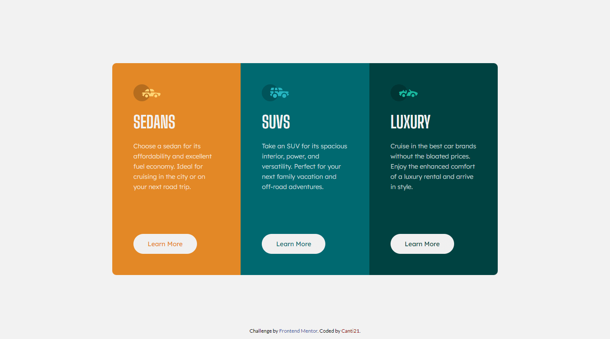
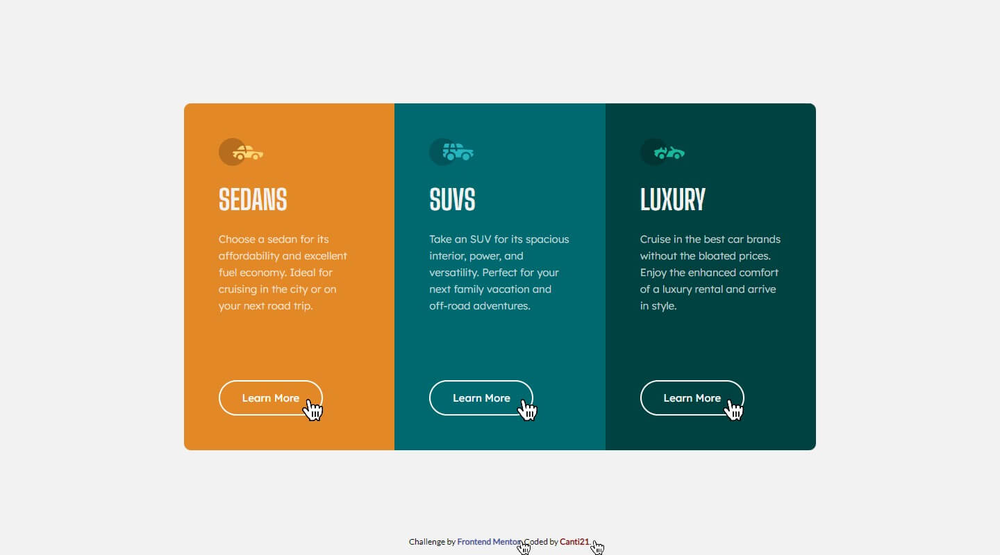

# Frontend Mentor - 3-column preview card component solution

This is a solution to the [3-column preview card component challenge on Frontend Mentor](https://www.frontendmentor.io/challenges/3column-preview-card-component-pH92eAR2-).

## Table of contents

- [Overview](#overview)
  - [The challenge](#🎯-the-challenge)
  - [Screenshots](#📷-screenshots)
  - [Links](#🔗-links)
- [Built with](#🛠-built-with)
- [Author](#🐱‍👤-author)

## Overview

### 🎯 The challenge

Users should be able to:

- View the optimal layout depending on their device's screen size
- See hover states for interactive elements

The target designs are in the [`/design`](./design/) folder.

### 📷 Screenshots

**Here is the final product**

🖥️ Desktop View:

📱 Mobile View:

**🌟 Active States**

### 🔗 Links

- Solution URL: [FrontEnd Mentor]()
- Live Site URL: [Deploy]()

## 🛠 Built with

- Semantic HTML5 markup
- CSS custom properties
- Flexbox
- CSS Grid
- Mobile-first workflow

## 🐱‍👤 Author

- Frontend Mentor - [@Canti21](https://www.frontendmentor.io/profile/Canti21)
- Twitter - [@Canti2100](https://www.twitter.com/Canti2100)